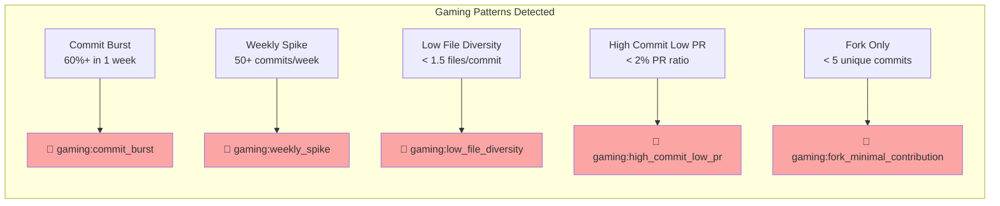

# GitHub Portfolio Analysis System

A visual guide to how candidate GitHub profiles are analyzed and scored.

---

## 📊 Analysis Pipeline Overview

```mermaid
flowchart TD
    subgraph Input
        A[GitHub URL] --> B[Parse Username]
    end
    
    subgraph "Data Collection"
        B --> C[Basic Profile<br/>githubService]
        B --> D[Detailed Metrics<br/>githubRepoMetricsService]
        C --> E[Top 5 Repos]
        E --> D
    end
    
    subgraph "Scoring Engine"
        D --> F[Activity Score<br/>0-10]
        D --> G[Collaboration Score<br/>0-10]
        D --> H[Quality Score<br/>0-10]
        D --> I[Documentation Score<br/>0-10]
    end
    
    subgraph "Risk Detection"
        D --> J[Gaming Detection]
        D --> K[Quality Flags]
        J --> L[Risk Flags Array]
        K --> L
    end
    
    subgraph Output
        F & G & H & I --> M[Overall Score]
        L --> N[LLM Summary]
        M --> N
        N --> O[Portfolio Analysis]
    end
    
    style F fill:#4ade80
    style G fill:#60a5fa
    style H fill:#f472b6
    style I fill:#facc15
    style L fill:#f87171
```



---

## 🏆 Scoring Categories

### Activity Score (0-10)

| Factor | Healthy Range | Penalty |
|--------|---------------|---------|
| Commits/month | 2-50 | < 2 (-1), > 100 (-3) |
| Last push | < 30 days (+1) | > 180 days (-2) |
| Inactivity gaps | < 90 days | > 180 days (-2) |
| Repo age | 1+ years (+0.5) | 3+ years (+1) |

### Collaboration Score (0-10)

| Factor | Ideal | Penalty |
|--------|-------|---------|
| PR merge rate | 50-95% | < 30% (-2) |
| PR size (files) | 1-15 | > 50 (-2) |
| External contributors | 3+ (+2) | 0 (neutral) |
| Stale PRs | < 50% open | > 50% open (-1) |

### Quality Signals Score (0-10)

| Signal | Points |
|--------|--------|
| Has tests | +3 |
| Has CI (GitHub Actions) | +3 |
| Has linter (ESLint/Prettier) | +2 |
| Zero security alerts | +2 |
| 10+ security alerts | -1 |

### Documentation Score (0-10)

| Factor | Points |
|--------|--------|
| README 5000+ chars | +4 |
| README 2000+ chars | +3 |
| Has install section | +1 |
| Has usage section | +1 |
| Has license | +2 |
| 5+ releases | +2 |

---

## 🚨 Anti-Gaming Detection



### Flag Severity Levels

| Severity | Impact | Examples |
|----------|--------|----------|
| 🔴 High | -10 points | Abandoned, fork-only, security alerts |
| 🟠 Medium | -5 points | Commit burst, low diversity, no tests |
| 🟡 Low | Flagged only | Giant PRs, stale PRs, no license |
| ⚪ Info | No impact | Is a fork (with contributions) |

---

## 💪 Strength Detection

```
✅ actively_maintained  → Pushed < 30 days + 2+ commits/month
✅ community_driven     → 3+ external contributors
✅ clean_pr_workflow    → 60-95% merge rate + < 15 files/PR
✅ tested_with_ci       → Has tests + GitHub Actions
✅ well_documented      → 2000+ char README + install + usage
✅ versioned_releases   → 5+ releases
✅ mature_stable        → 2+ years old + < 90 day gaps
✅ code_quality_tools   → ESLint/Prettier/Biome detected
```

---

## 📦 Output Format (LLM-Optimized)

```json
{
  "repo": "my-awesome-project",
  "scores": {
    "activity": 7.5,
    "collaboration": 6.0,
    "quality_signals": 8.0,
    "documentation": 5.0,
    "overall": 6.8
  },
  "signals": {
    "activity": {
      "commits_monthly": 12,
      "last_push": "3d ago",
      "age": "2.1y",
      "max_gap": "14d"
    },
    "collaboration": {
      "prs": 45,
      "merge_rate": "72%",
      "pr_size_avg": 8.3,
      "contributors": 5
    },
    "quality": {
      "tests": true,
      "ci": true,
      "linters": 2,
      "security_issues": 0
    },
    "docs": {
      "readme_size": "good",
      "has_install": true,
      "has_usage": true,
      "license": "MIT",
      "releases": 12
    }
  },
  "risk_flags": [],
  "strengths": ["actively_maintained", "tested_with_ci"]
}
```

---

## 🔗 Service Integration

```
┌─────────────────────────────────────────────────────────────────────┐
│                         FRONTEND (SvelteKit)                         │
│  User enters GitHub URL → API call to /api/portfolio/analyze        │
└─────────────────────────────────────────────────────────────────────┘
                                    │
                                    ▼
┌─────────────────────────────────────────────────────────────────────┐
│                         BACKEND (Fastify)                            │
│                                                                      │
│  portfolio.js routes                                                 │
│      │                                                              │
│      ▼                                                              │
│  portfolioAnalyzer.js                                               │
│      ├── githubService.js (basic profile + top projects)           │
│      ├── githubRepoMetricsService.js (detailed metrics + scores)   │
│      └── geminiService.js (AI-enhanced scoring)                    │
│                                                                      │
│  Output: PortfolioAnalysis (saved to MongoDB)                       │
└─────────────────────────────────────────────────────────────────────┘
```

---

## ⚡ API Endpoints

| Endpoint | Method | Purpose |
|----------|--------|---------|
| `/api/portfolio/analyze` | POST | Full portfolio analysis |
| `/api/github/evaluate` | POST | GitHub maturity evaluation |
| `/api/github/quick/:username` | GET | Quick assessment |
| `/api/github/batch-evaluate` | POST | Batch candidate screening |

---

*Last Updated: January 6, 2026*
